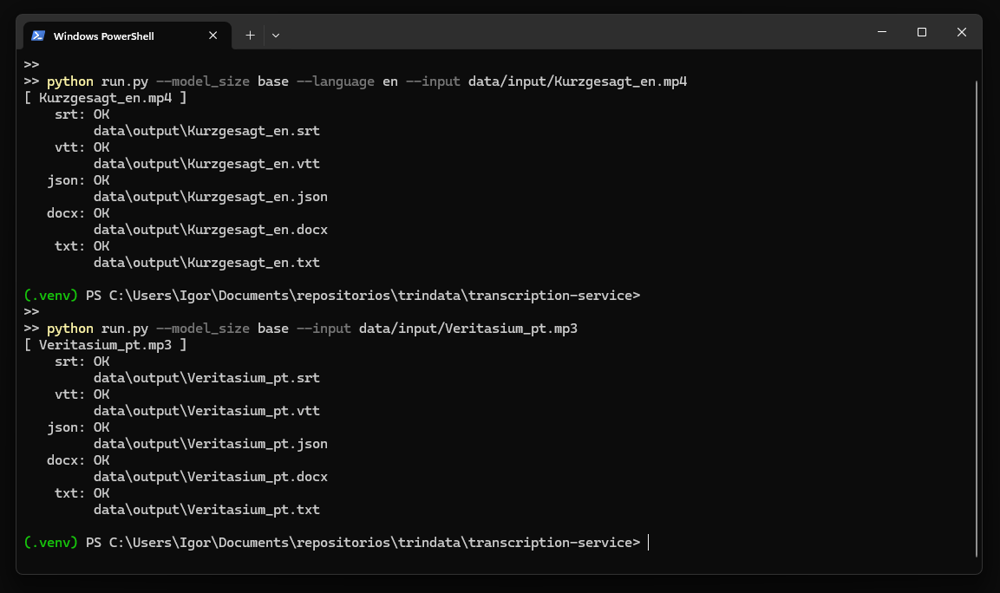
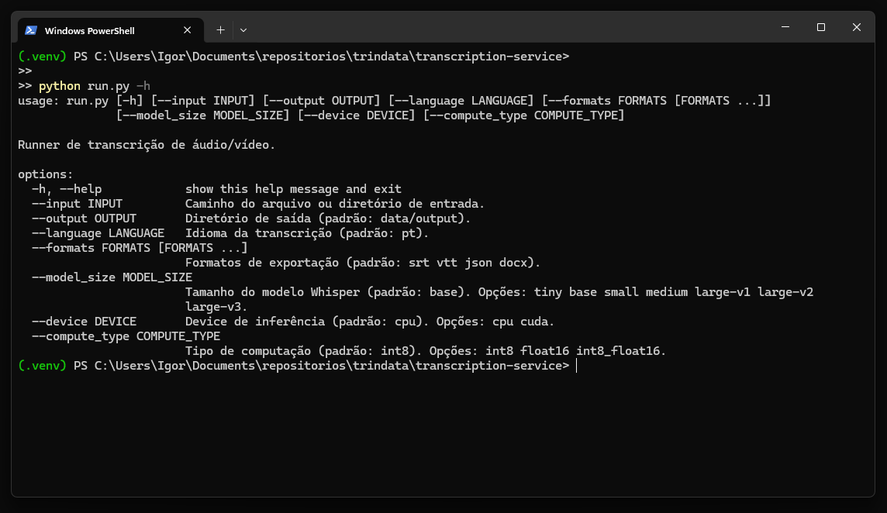

# 🎙️ Transcription Service

Serviço de transcrição de áudio e vídeo em Python, construído sobre o modelo **Whisper** via [faster-whisper](https://github.com/SYSTRAN/faster-whisper). Converte arquivos de mídia em texto e exporta para múltiplos formatos com uma CLI simples.

---

## ✨ Funcionalidades

- Transcrição de arquivos de áudio e vídeo (`.mp3`, `.wav`, `.m4a`, `.mp4`, `.flac`, `.ogg`)
- Exportação para **TXT, SRT, VTT, JSON e DOCX**
- Processamento em **batch** de diretórios inteiros
- Falhas isoladas — um arquivo com erro não cancela o lote
- CLI com suporte a múltiplos argumentos (modelo, idioma, formatos, device)
- Suíte de testes com **63 testes automatizados** (pytest + mocks)

---

## 🖥️ Uso





---

## 📦 Outputs de exemplo

**SRT** — pronto para legendas:
```
1
00:00:00,000 --> 00:00:04,280
Você tem direito à cidadania italiana?

2
00:00:04,280 --> 00:00:08,160
O primeiro passo pode ser mais simples do que você imagina.
```

**DOCX** — com metadados e segmentos timestampados:

| Campo    | Valor         |
|----------|---------------|
| Idioma   | pt (99%)      |
| Duração  | 33.0s         |
| Palavras | 72            |

---

## 🚀 Como usar

### Instalação

```bash
git clone https://github.com/trindata/transcription-service.git
cd transcription-service

python -m venv .venv
.venv\Scripts\activate        # Windows
# source .venv/bin/activate   # Linux/Mac

python.exe -m pip install --upgrade pip
pip install -r requirements.txt
```

### Uso básico

```bash
# Transcrever um arquivo
python run.py --input data/input/aula.mp4

# Transcrever todos os arquivos de um diretório
python run.py --input data/input/

# Rodar com defaults (batch em data/input/)
python run.py
```

### Argumentos disponíveis

```bash
python run.py --help
```

| Argumento       | Padrão       | Descrição                                      |
|-----------------|--------------|------------------------------------------------|
| `--input`       | `data/input` | Arquivo ou diretório de entrada                |
| `--output`      | `data/output`| Diretório de saída                             |
| `--language`    | automatico   | Idioma da transcrição: `pt`, `en` ...          |
| `--formats`     | todos        | Formatos: `srt vtt json docx txt`              |
| `--model_size`  | `base`       | Tamanho do modelo Whisper                      |
| `--device`      | `cpu`        | Device de inferência: `cpu` ou `cuda`          |
| `--compute_type`| `int8`       | Tipo de computação: `int8`, `float16`          |

### Exemplos avançados

```bash
# Exportar só JSON e TXT em inglês
python run.py --input aula.mp4 --language en --formats json txt

# Usar modelo maior com GPU
python run.py --input data/input/ --model_size large-v3 --device cuda --compute_type float16

# Salvar em diretório customizado
python run.py --input aula.mp4 --output exports/
```

---

## 🏗️ Arquitetura

```
transcription-service/
├── app/
│   ├── services/
│   │   ├── transcription_service.py   # Lógica de transcrição (single + batch)
│   │   └── transcription_exporter.py  # Exportação para múltiplos formatos
│   └── utils/
│       └── AudioCorruptor.py          # Utilitário para geração de casos de teste
├── tests/
│   ├── conftest.py                    # Fixtures compartilhadas
│   ├── test_transcription_service.py
│   ├── test_transcription_exporter.py
│   └── test_cli.py
├── data/
│   ├── input/                         # Arquivos de entrada
│   └── output/                        # Saídas geradas
├── run.py                             # CLI principal
├── pytest.ini
├── requirements.txt
└── requirements-dev.txt
```

### Decisões de design

**Fail-fast nas bordas, resiliente no core.** As validações de entrada (arquivo inexistente, extensão inválida, diretório vazio) falham rápido e retornam erros descritivos. Dentro do batch, uma falha em um arquivo não cancela os demais — cada resultado é encapsulado individualmente.

**Separação de responsabilidades clara.** O `TranscriptionService` só sabe transcrever. O `TranscriptionExporter` só sabe exportar. O `run.py` orquestra os dois via CLI, mas não contém lógica de negócio.

**Retorno estruturado consistente.** Todos os métodos retornam dicts com `success`, `error` e payload — nunca lançam exceções para o caller. Isso facilita integração em pipelines maiores.

---

## 🧪 Testes

```bash
pip install -r requirements-dev.txt
pytest tests/ -v
```

63 testes cobrindo:
- Validações de entrada (arquivo não encontrado, extensão inválida, diretório vazio)
- Comportamento com áudio corrompido, silêncio e ruído
- Cada writer de exportação (TXT, SRT, VTT, JSON, DOCX)
- Roteamento da CLI (single vs batch, defaults, argumentos)
- Falha parcial em batch sem cancelar o lote

O modelo Whisper é **mockado** nos testes — sem download, sem GPU, sem lentidão.

---

## 🤖 Modelos disponíveis

| Modelo      | Velocidade | Precisão | VRAM    |
|-------------|------------|----------|---------|
| `tiny`      | ⚡⚡⚡⚡⚡  | ⭐⭐      | ~1 GB   |
| `base`      | ⚡⚡⚡⚡   | ⭐⭐⭐    | ~1 GB   |
| `small`     | ⚡⚡⚡     | ⭐⭐⭐⭐  | ~2 GB   |
| `medium`    | ⚡⚡       | ⭐⭐⭐⭐⭐ | ~5 GB   |
| `large-v3`  | ⚡         | ⭐⭐⭐⭐⭐ | ~10 GB  |

Para uso em CPU sem GPU, `base` e `small` oferecem o melhor equilíbrio.

---

## 📋 Requisitos

- Python 3.10+
- FFmpeg instalado no sistema ([download](https://ffmpeg.org/download.html))

---

## 📄 Licença

MIT — veja o arquivo [LICENSE](LICENSE) para detalhes.